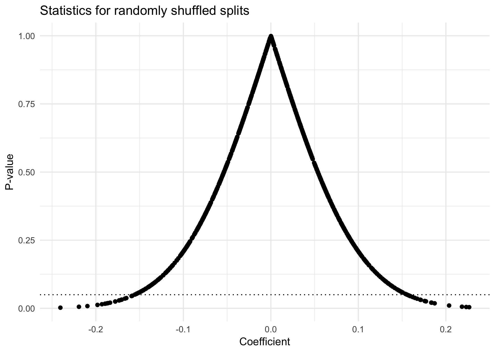

```r
set.seed(1)

NUM_HACKS = 1000

X_MEAN = sample(1:1000, 1)
X_SD = sample(1:10, 1)
Y_MEAN = sample(1:1000, 1)
Y_SD = sample(1:10, 1)

x = rnorm(1000, mean=X_MEAN, sd=X_SD)
y = rnorm(1000, mean=Y_MEAN, sd=Y_SD)

og_data = data.frame(x=x, y=y)

og_data %>%
  ggplot(aes(x = x,
             y = y)) +
  geom_point() +
  theme_minimal()
```


```r
test_coef = c()
test_p = c()
size_v = c()
for (i in c(1:NUM_HACKS)) {
  new_x = sample(x)
  new_test = summary(lm(y ~ new_x))
  test_coef[i] = new_test$coefficients[2]
  test_p[i] = new_test$coefficients[8]
}

d = data.frame(coef = test_coef,
               p = test_p)

d %>%
  ggplot(aes(x = test_coef,
             y = test_p)) +
  geom_point() +
  geom_hline(yintercept = .05, linetype = "dotted") +
  labs(x = "Coefficient",
       y = "P-value",
       title = "Statistics for randomly shuffled splits") +
  theme_minimal()
```

